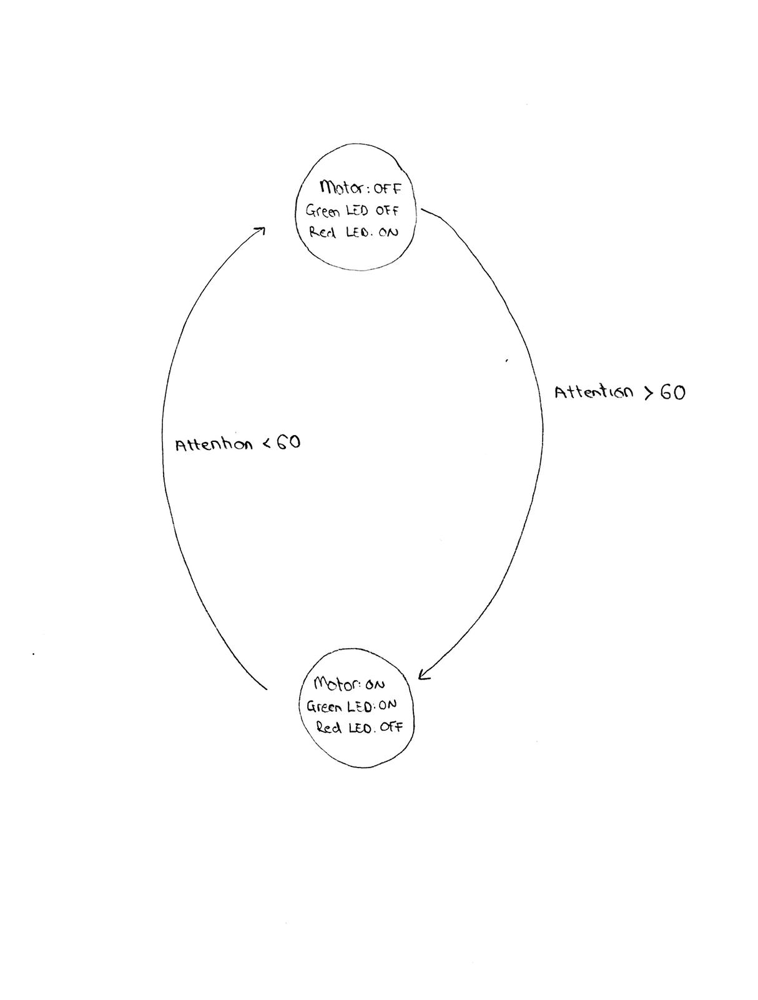

# IDD-Final-Project

## Project Description and Initial Plan

### Idea and Application

The project consists of a prototype for a wheelchair that can be controlled via electroencephalogram (EEG) sensing. The main application of this wheelchair is to enable paralyzed individuals to have control over their transportation by using their concentration levels. 

### Team

Alana Crognale

Eva Esteban

Tomi Kalejaiye

### Rough Form and Paper Prototype

### Expected Parts

EEG headset, Arduino, wheels, motors, LEDs, small physical wheelchair prototype.

### Interaction Plan

For the first prototype, the person will wear the headset and control the wheelchair forward movement with it. For future work, additional signals can be measured to enable the person to rotate the chair on its axis. Moreover, a third iteration on the product will make the headset wireless by incorporating a Bluetooth Low Energy (BLE) module. 

## Project Implementation 

### Hardware Components

We bought the Star Wars Force Trainer II toy, which contains an EEG sensing headset that uses a NeuroSky board. We also gathered a green LED and a green LED with their corresponding 220 Ohm resistors, and a motor with its corresponding components to build a protective circuit around it: a transistor, a 2.2 KOhm resistor, and a regular diode. We also used a graphic display screen. We used an Adafruit Metro Mini to control the different components, and a breadboard with wires to connect them together. Finally, we added a 9V battery to power the Metro Mini, which then powers the rest of the circuit with 5V.

### System Description

The EEG headset measures the different human brain waves such as delta, theta, l-alpha, h-alpha, l-beta, h-beta, l-gamma, m-gamma, meditation, and attention. These values are read by using the Metro Mini connected to the transmitter (T) pin of the EEG sensing board - for this we opened up the toy and soldered a cable to the T pin and another cable to GND to ensure the two components had a common ground. 

The attention values range from 0 to 100, with 0 indicating that the user is not concentrating at all, and 100 meaning the user has reached the maximum atttention value measurable. Using the Metro Mini, this value gets thresholded at around 60 - a threshold that can be modified according to the difficulty the person wearing the headset might have. When the attention value is above 60, the Metro Mini turns the motor on and the wheel starts rotating. Also, the green LED turns on and the red LED turns off. The LEDs help both the person moving the wheel to concentrate and get feedback on how they are doing, and the people around to know whether the chair is moving. When the value goes below 60, the wheel stops, the green LED turns off, and the red LED turns on to indicate that the chair is not moving. 

The state diagram for the product can be found below. 

### Firmware

In order to read from the headset, the base code from https://github.com/JimRoskind/NeuroskyHacking was used as a starting point. The code and libraries were modified in order to take only the attention valueinto account, and remove the parts of the code processing and printing unnecessary values. Additional code was incorporated to interact with the LEDs, the wheel motor, and to print values to the graphic display without stopping the code from running and overflowing the buffer as a consequence. 

A link to the final code can be found below.

[Link to Code](https://github.com/evaesteban/IDD-Final-Project/blob/master/ForceTrainer_Code/ForceTrainer_Code.ino)

### Testing and Debugging 

Even though the initial idea for the project was to create the full wheelchair prototype, the final deliverable was a proof of concept to demonstrate that both the wheel and the LEDs can be controlled solely by using a person's concentration levels. This simplification was implemented for two main reasons: a large amount of time had to be spent on debugging and understanding the data being read from the headset rather than building a small wheel chair structure, and green/red LED functionality to provide feedback on the chair movement was included. Even though the LEDs feature was not in the original project description, user testing proved it to be necessary for the person to know whether the chair was moving and they were concentrating appropriately, so building this feature was prioritized in order to make the device more interactive.

In order to read the values from the headset, a baud rate of 9600 bits/sec was used. We then realized that this only worked for the Force Trainer I device, but the new Force Trainer II used a baud rate of 57600. Secondly, we found that the packets from the headset were being sent to the Arduino and filling up the buffer at a very high speed, causing even printing to serial to corrupt the data reading process. We therefore decided to remove all delays and limit the use of the serial interface to debugging when needed. Once these errors were fixed, we could read the values from the headset correctly. 

In order to use the motor and prevent it from drawing too much power, we used a diode and a transistor. Debugging the circuit, we found that the transistor was damaged and exchanged it for a new one. We found this fault by isolating and testing each component, as well as testing the hardware separate from the firmware.

To print the values in the graphic display every 100 ms, we used millis() instead of delay(), as we found using delay() prevented the Metro Mini from reading the headset values and caused information loss.

There were many other debugging instances, but the above three are fundamental to the correct functioning of the project and likely to happen to other people building similar devices, so we decided to highlight them.

## Project Video 

An initial video of the barebone product can be found below.

[Link to Initial Video](Wheel_Video.mp4)

We then incorporated a battery for increased portability, as well as a graphic display to be able to read the attention values the user outputs to the device in real time.

[Link to Final Video](https://github.com/evaesteban/IDD-Final-Project/blob/master/IMG_1105.mov)

## Future Work

In the future, we would like to build a full wheelchair prototype which is also able to spin, as explained in the introduction above. We would also calibrate the sensor by measuring the brain waves of different people and using more brain wave information apart from the attention values - these were used to prove the concept.

